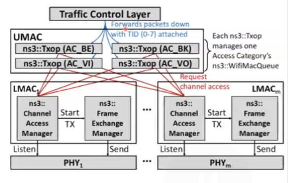
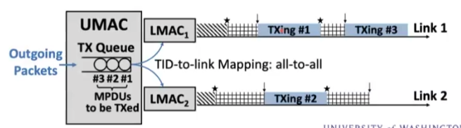

# Multi Link Operation(MLO)

Much for STA instead of AP

only MAC layer changes

### New features in MAC layer:

​	WiFi6(2019) and WiFi6E(2021): Target Wake Time (TWT)

​	WiFi7: MultiLink Operation

### New features in PHY layer:

​	WiFi6 and WiFi6E: OFDMA, MU-MIMO, BSS color, 1024QAM, 6Ghz

​	WiFi7: 4096QAM, 320MHz BW, 16 spatial stream, Multi-RU

Compared with 5GHz, higher MCS can be achieved in 2.4GHz at the same distance

### type of MLO:

Multi Link Single Radio (M LSR)

​	同时只能保证一条link工作，另一条link处于power save的状态

Enhanced multi link single radio (E MLSR)

NonSimultaneous Transmit and Receive multi link multi radio (NSTR MLMR)

Simultaneous Transmit and Receive multi link multi radio (STR MLMR)

enhanced multi link multi radio  (E MLMR)

access delay due to the DCF, transmission delay due to the MCS selection

### Example

select best link

aggregate 5Ghz and 6Ghz

achieve full duplex

### 2 MAC Layers

upper MAC: for connectivity and interface with LLC

lower MAC: for medium access and data transmission

only 1 MAC address  used, MLD MAC address

packet-level aggregation: aggregate packets from the same TID across multiple links

flow-level aggregation

### Device Discovery

AP MLD transmit a link specific SSID and also an MLO SSID

active scan 例如发送探测请求or passive scan 例如监听信标帧

More efficient method: RNR

### In NS3

MLO = simultaneous use of multiple links using **STR(simultaneous Tx and Rx)** and **TID-to-Link Mapping**

Architecture of ns3 MLO from channel access perspective:

​	Upper MAC requests channel access from lower MAC

​	ns3::CAM listens to per-link PHY, decides when access is granted to upper MAC

​	With access granted, ns3::FEM sets para for transmitting **MPDU(MAC protocol Data Unit)** then forward to PHY

The greedy method of Traffic-to-Link Allocation:

​	Packets queuing in upper MAC, Lower MAC starts DCF

### Analytical Model of Delay in MLO:

